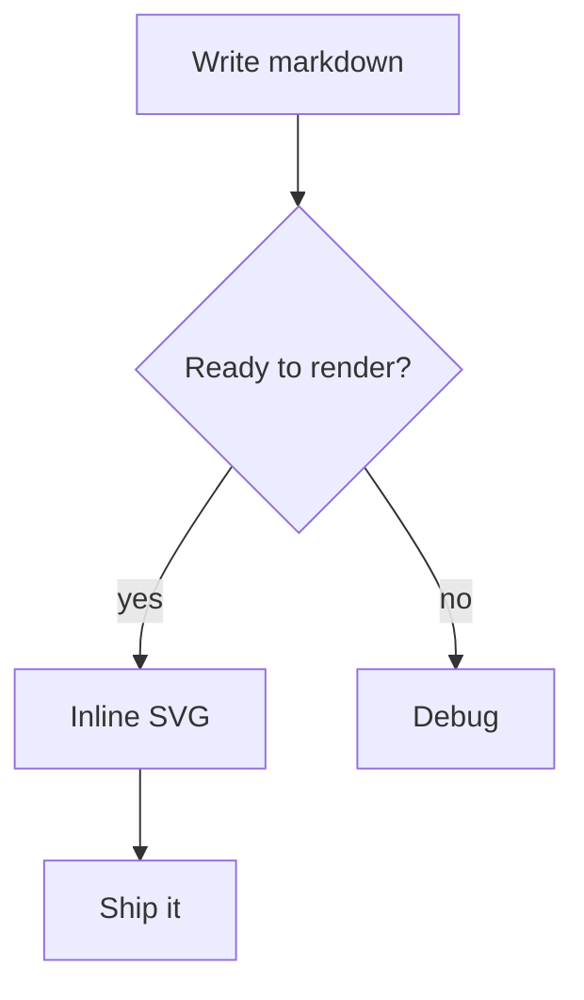
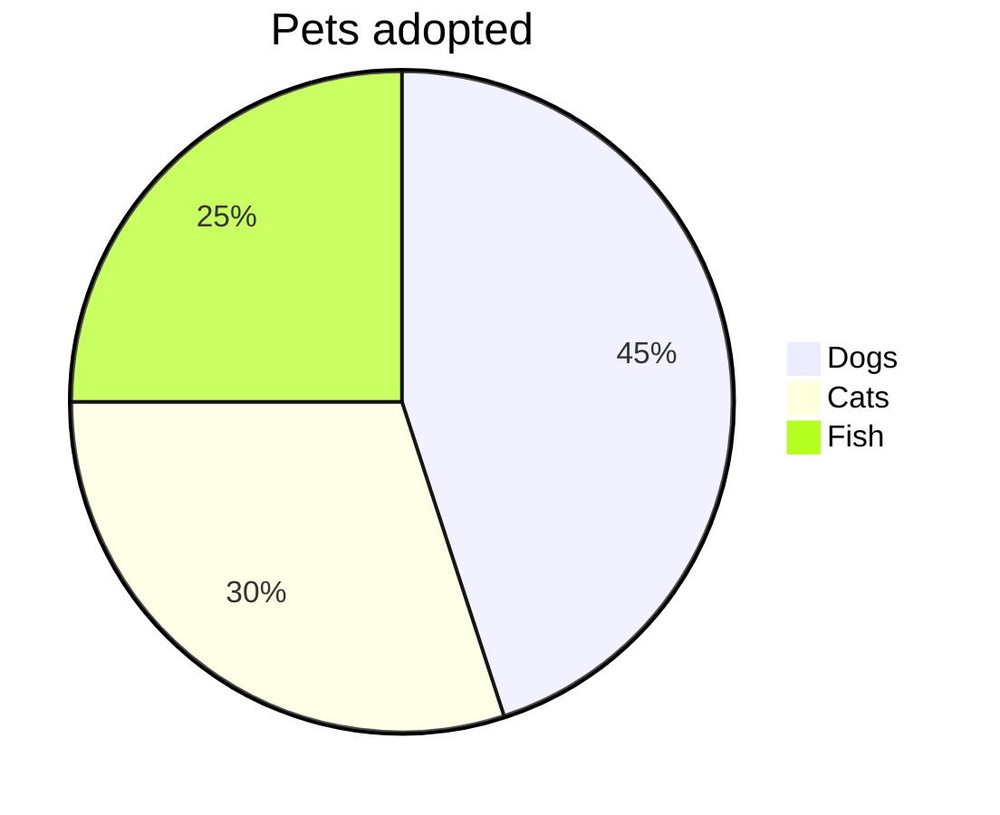
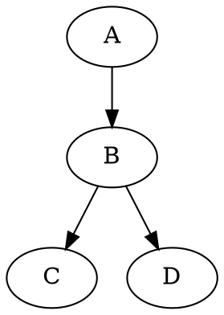

Here is everything mdweb's markdown engine understands beyond CommonMark:
inline math, display equations, drawing environments, Mermaid diagrams,
Graphviz and PlantUML, tables, admonitions, definition lists,
superscript/subscript, highlights, emoji and HTML comments — all compiled
to inline SVG or styled HTML at build time, with no client-side libraries.

[[TOC]]

## Inline and display math

Inline math is written `$a^2 + b^2 = c^2$` (or the equivalent `$$…$$` /
`\(…\)`) and renders as native MathML — no libraries, no JavaScript.
Display equations live inside a fenced ` ```math ` block; the LaTeX
`\[…\]` form or a multi-line `$$\n…\n$$` block are accepted as well:

```math
\sum_{i=1}^{n} i = \frac{n(n+1)}{2}
```

Fractions, roots and Greek letters all work: $E = mc^2$, $\sqrt{x}$,
$\alpha\beta\gamma$. The quadratic formula inline:

> The quadratic formula is $x = \frac{-b \pm \sqrt{b^2 - 4ac}}{2a}$ for
> $ax^2 + bx + c = 0$, and it has survived for centuries.

For a deeper gallery of integrals, matrices, xypic and TikZ examples, see
the [Math examples](/pages/docs/math-examples/) page.

## Drawing environments

Beyond formulas, fenced blocks tagged `latex` / `tikz` / `xy` / `picture`
(or `\[…\]`) also accept the classic `picture`, xy-pic and TikZ packages.
Math inside their labels is still typeset by the same formula engine:

```math
\xymatrix{
  A \ar[r]^f \ar[d]_g & B \ar[d]^{g'} \\
  D \ar[r]_{f'}        & C
}
```

A TikZ plot with axes, a sine curve and a label:

```latex
\begin{tikzpicture}
\draw[->] (-3.5,0) -- (3.5,0) node[right] {$x$};
\draw[->] (0,-1.5) -- (0,1.5) node[above] {$y$};
\draw[color=blue] plot[domain=-3.1416:3.1416,samples=100] (\x,{sin(\x r)}) node[above right] {$y=\sin x$};
\end{tikzpicture}
```

## Mermaid flowcharts

Fenced blocks tagged `mermaid` render to inline SVG. The renderer covers
`graph` / `flowchart` in any of the four directions (`TD`/`LR`/`RL`/`BT`),
seven node shapes, four edge styles (`-->`, `---`, `-.->`, `==>`),
`|label|` and `-- label -->` edge labels, `subgraph` boxes and `%%`
comments:



## More native diagrams

`pie` and `gantt` charts render natively, as do Graphviz `digraph` and
PlantUML class diagrams. Examples:





Anything mdweb doesn't recognise natively (Mermaid `sequenceDiagram`,
`stateDiagram-v2`, `journey`, PlantUML `sequence`/`activity`, …) falls
back gracefully to a code block — you can keep iterating on a diagram
without breaking the page.

## Markdown tables

GFM pipe tables work as in any other renderer — no plugin, no extra fence:

| Month | Sales | YoY  |
| ----- | ----- | ---- |
| Jan   | 120   | +5%  |
| Feb   | 135   | +12% |
| Mar   | 98    | −3%  |

## Admonitions

GitHub-style alerts produce styled boxes. The alert type is `[!NOTE]` /
`[!TIP]` / `[!IMPORTANT]` / `[!WARNING]` / `[!CAUTION]` (plus `[!INFO]`,
`[!SUCCESS]` and `[!DANGER]`); a custom title may follow the marker on the
same line:

> [!NOTE]
> Useful information that users should know, even when skimming.

> [!TIP] Good ideas
> Better ideas to help you succeed.

> [!IMPORTANT]
> Key information users need to know to achieve their goal.

> [!WARNING]
> Urgent info that needs immediate user attention to avoid problems.

> [!CAUTION]
> Advises about risks or negative potential outcomes.

> [!INFO]
> Non-critical background details.

> [!SUCCESS]
> Confirms a successful outcome or result.

> [!DANGER]
> Reserved for critical, system-breaking consequences.

## Definition lists

A paragraph followed by `:` lines becomes a definition list:

Term
: the meaning of the term, in one line
: a second meaning, still attached to the same term

## Superscript, subscript and highlights

Chemical notation: H~2~O and x^2^; mark important phrases with ==double equals==.

## Emoji

Shortcodes expand to emoji: :rocket: :smile: :wave: — unknown codes like
`:no_such_code:` are left untouched.

## HTML comments

Comments `<!-- like this -->` are stripped from the output entirely, so you
can leave private notes in your drafts.