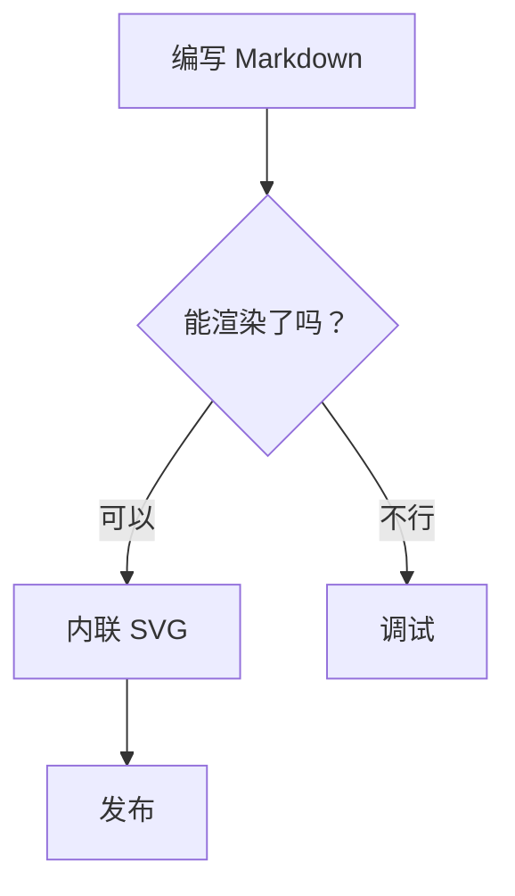
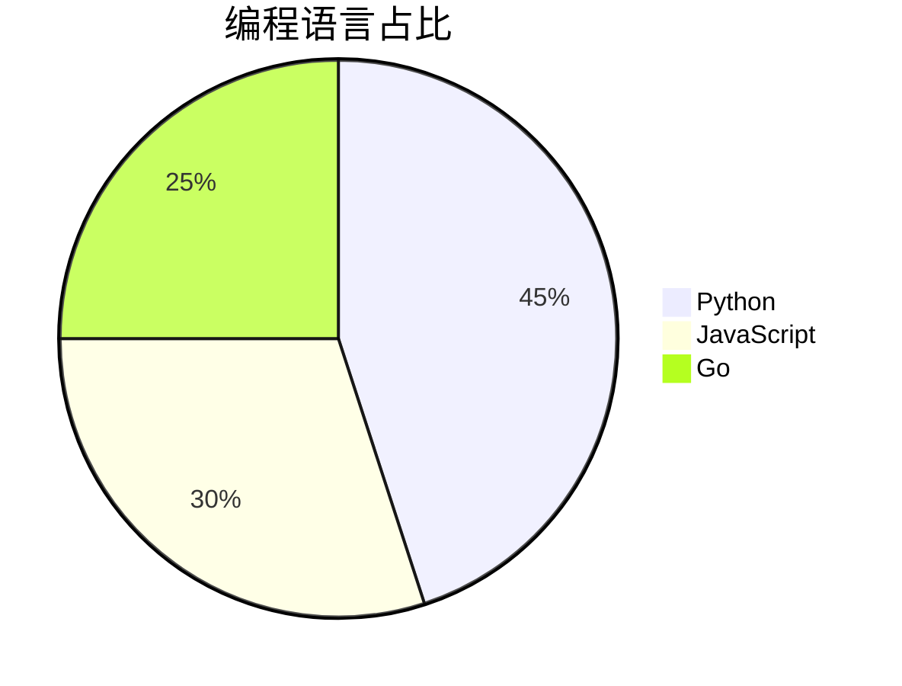
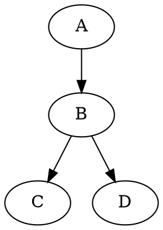

这里展示 mdweb 的 Markdown 引擎在 CommonMark 之外支持的全部语法：
行内公式、块级公式、绘图环境、Mermaid 图表、Graphviz 与 PlantUML、
表格、警告框、定义列表、上标/下标、高亮、Emoji 和 HTML 注释——全部在
构建时编译为内联 SVG 或带样式的 HTML，无需任何客户端库。

[[TOC]]

## 行内与块级公式

行内公式写作 `$a^2 + b^2 = c^2$`（或等价的 `$$…$$` / `\(…\)`），以
浏览器原生 MathML 渲染——无需任何库或 JavaScript。块级公式写在
` ```math ` 围栏中，也可使用 LaTeX 的 `\[…\]` 形式或多行
`$$\n…\n$$` 块：

```math
\sum_{i=1}^{n} i = \frac{n(n+1)}{2}
```

分式、根号与希腊字母都支持：$E = mc^2$、$\sqrt{x}$、
$\alpha\beta\gamma$。行内求根公式：

> 一元二次方程 $ax^2 + bx + c = 0$ 的求根公式为
> $x = \frac{-b \pm \sqrt{b^2 - 4ac}}{2a}$，沿用至今。

关于积分、矩阵、xypic 与 TikZ 的更多示例，见
[数学示例](/pages/docs/math-examples/) 页面。

## 绘图环境

除公式外，语言标记为 `latex` / `tikz` / `xy` / `picture` 的围栏代码块
（或 `\[…\]` 包裹）还接受 `picture`、xy-pic 与 TikZ 三种经典绘图包。
标签里出现的公式仍由同一个数学引擎排版：

```math
\xymatrix{
  A \ar[r]^f \ar[d]_g & B \ar[d]^{g'} \\
  D \ar[r]_{f'}        & C
}
```

带坐标轴、正弦曲线与标签的 TikZ 绘图：

```latex
\begin{tikzpicture}
\draw[->] (-3.5,0) -- (3.5,0) node[right] {$x$};
\draw[->] (0,-1.5) -- (0,1.5) node[above] {$y$};
\draw[color=blue] plot[domain=-3.1416:3.1416,samples=100] (\x,{sin(\x r)}) node[above right] {$y=\sin x$};
\end{tikzpicture}
```

## Mermaid 流程图

标记为 `mermaid` 的围栏代码块渲染为内联 SVG。引擎支持
`graph` / `flowchart` 头、四种方向（`TD`/`LR`/`RL`/`BT`）、七种节点
形状、四种边样式（`-->`、`---`、`-.->`、`==>`）、`|label|` 与
`-- label -->` 边标签、`subgraph` 子图与 `%%` 注释：



## 更多原生图表

`pie` 饼图与 `gantt` 甘特图原生渲染，Graphviz `digraph` 与 PlantUML
类图同样如此。举例如下：





mdweb 原生不认识的语法（如 Mermaid 的 `sequenceDiagram`、
`stateDiagram-v2`、`journey`，PlantUML 的 `sequence` / `activity` 等）
会自动退化为代码块，调试时不会破坏页面。

## Markdown 表格

GFM 管道表格与其它渲染器一致——无需插件、无需额外围栏：

| 月份   | 销售额（万） | 同比增长 |
| ------ | ------------ | -------- |
| 1 月   | 120          | +5%      |
| 2 月   | 135          | +12%     |
| 3 月   | 98           | −3%      |

## 警告框

GitHub 风格的提示会渲染为带样式的盒子：

> [!NOTE]
> 供用户了解的有用信息，即使快速浏览也应知晓。

> [!TIP]
> 帮助你成功的更好的建议。

> [!WARNING]
> 需要立即注意以避免问题的紧急信息。

## 定义列表

段落后跟 `:` 行即成为定义列表：

术语
: 该术语的含义，用一行说明
: 同一术语的第二个释义

## 上标、下标与高亮

化学式：H~2~O 与 x^2^；用 ==双等号== 高亮重要短语。

## Emoji

短代码展开为 Emoji：:rocket: :smile: :wave: —— 未知代码（如 `:no_such_code:`）
保持原样。

## HTML 注释

注释 `<!-- 就像这样 -->` 会从输出中完全移除，可以在草稿里留下私人备忘。