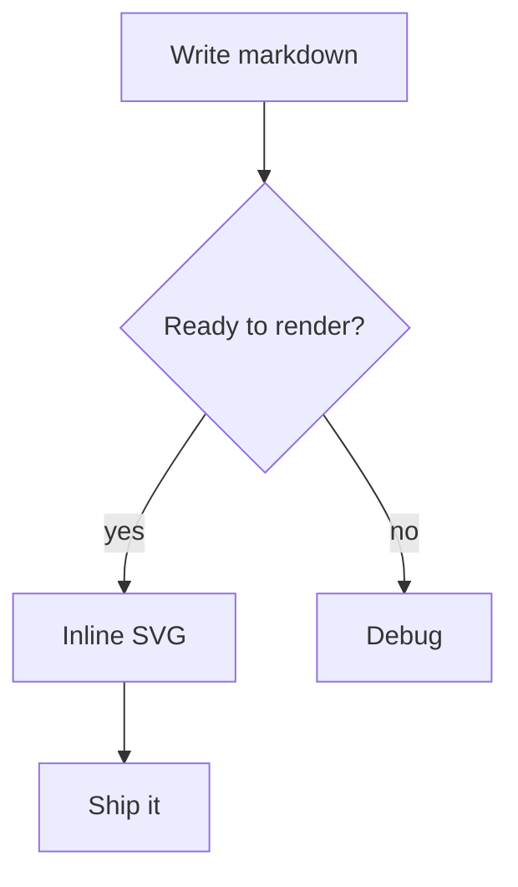

Here is everything mdweb's markdown engine understands beyond CommonMark:
inline math, display equations, Mermaid diagrams, admonitions, a table of
contents, superscript/subscript, highlights, emoji and definition lists.

[[TOC]]

## Inline and display math

Inline math is written `$a^2 + b^2 = c^2$` (or the equivalent `$$…$$`)
and renders as native MathML — no libraries, no JavaScript. Display
equations live inside a fenced ` ```math ` block; the LaTeX
`\[…\]` form or a multi-line `$$\n…\n$$` block are accepted as well:

```math
\sum_{i=1}^{n} i = \frac{n(n+1)}{2}
```

Fractions, roots and Greek letters all work: $E = mc^2$, $\sqrt{x}$,
$\alpha\beta\gamma$.

A math fenced block works too:

```math
\int_0^{\infty} e^{-x^2} \, dx = \frac{\sqrt{\pi}}{2}
```

## Mermaid flowcharts

Fenced blocks tagged `mermaid` render to inline SVG:



## Admonitions

GitHub-style alerts produce styled boxes:

> [!NOTE]
> Useful information that users should know, even when skimming.

> [!TIP]
> Better ideas to help you succeed.

> [!WARNING]
> Urgent info that needs immediate user attention to avoid problems.

> [!IMPORTANT]
> Crucial information necessary for users to succeed.

> [!CAUTION]
> Negative consequences if the advice is not followed.

## Definition lists

A paragraph followed by `:` lines becomes a definition list:

Term
: the meaning of the term, in one line
: a second meaning, still attached to the same term

Another term
: with indented continuation kept as part of the definition

## Superscript, subscript and highlights

Chemical notation: H~2~O and x^2^; mark important phrases with ==double equals==.

## Emoji

Shortcodes expand to emoji: :rocket: :smile: :wave: — unknown codes like
`:no_such_code:` are left untouched.

## HTML comments

Comments `<!-- like this -->` are stripped from the output entirely, so you
can leave private notes in your drafts.