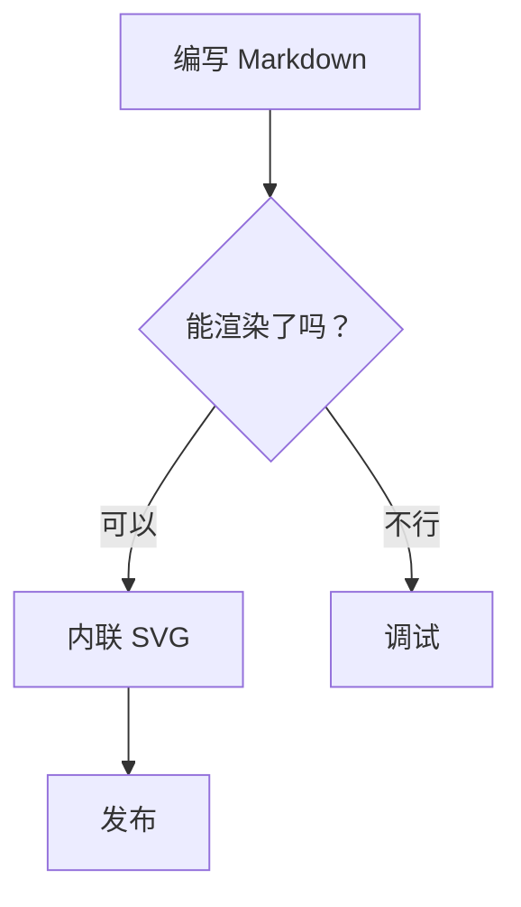

这里展示 mdweb 的 Markdown 引擎在 CommonMark 之外支持的语法：行内公式、
块级公式、Mermaid 图表、警告框、目录、上标/下标、高亮、Emoji 和定义列表。

[[TOC]]

## 行内与块级公式

行内公式写作 `$a^2 + b^2 = c^2$`（或等价的 `$$…$$`），以浏览器原生
MathML 渲染——无需任何库或 JavaScript。块级公式写在 ` ```math ` 围栏
中，也可使用 LaTeX 的 `\[…\]` 形式或多行 `$$\n…\n$$` 块：

```math
\sum_{i=1}^{n} i = \frac{n(n+1)}{2}
```

分式、根号与希腊字母都支持：$E = mc^2$、$\sqrt{x}$、$\alpha\beta\gamma$。

也可以使用 `math` 围栏代码块：

```math
\int_0^{\infty} e^{-x^2} \, dx = \frac{\sqrt{\pi}}{2}
```

## Mermaid 流程图

标记为 `mermaid` 的围栏代码块直接渲染为内联 SVG：



## 警告框

GitHub 风格的提示会渲染为带样式的盒子：

> [!NOTE]
> 供用户了解的有用信息，即使快速浏览也应知晓。

> [!TIP]
> 帮助你成功的更好的建议。

> [!WARNING]
> 需要立即注意以避免问题的紧急信息。

> [!IMPORTANT]
> 对用户成功至关重要的关键信息。

> [!CAUTION]
> 若不遵循建议可能带来负面后果。

## 定义列表

段落后跟 `:` 行即成为定义列表：

术语
: 该术语的含义，用一行说明
: 同一术语的第二个释义

另一个术语
: 带缩进的续行仍属于该定义

## 上标、下标与高亮

化学式：H~2~O 与 x^2^；用 ==双等号== 高亮重要短语。

## Emoji

短代码展开为 Emoji：:rocket: :smile: :wave: —— 未知代码（如 `:no_such_code:`）
保持原样。

## HTML 注释

注释 `<!-- 就像这样 -->` 会从输出中完全移除，可以在草稿里留下私人备忘。