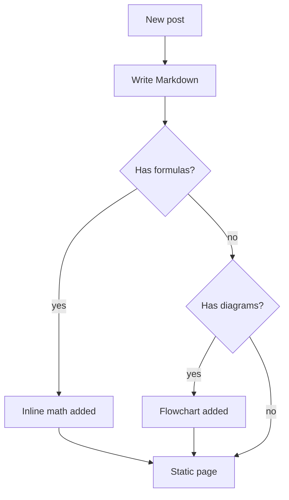

Markdown alone can't draw a formula, a diagram, or a flowchart, so mdweb
renders the most common syntaxes to SVG **at build time**:

- **LaTeX math** — `$…$` / `$$…$$` inline, `\(…\)` inline too; display
  formulas live in a fenced ` ```math ` block, the LaTeX `\[…\]` form,
  or a multi-line `$$\n…\n$$` block.
- **Drawing environments** — `picture`, xy-pic and TikZ environments
  inside a fenced `latex` / `tikz` / `xy` / `picture` block (or wrapped
  in `\[…\]`) become vector graphics, with formulas in their labels
  typeset by the same math engine.
- **Mermaid flowcharts** — a fenced code block tagged `mermaid`.

The output is inline `<svg>` written straight into the HTML. No MathJax,
no Mermaid.js, no CDN — pages are fully offline and load nothing extra.

## Inline math

Inline formulas sit in the sentence with `$…$` (or `$$…$$`):

> The quadratic formula is $x = \frac{-b \pm \sqrt{b^2 - 4ac}}{2a}$ for
> $ax^2 + bx + c = 0$, and it has survived for centuries.

The parenthesized spelling `\(…\)` works identically:
$\mathrm{e}^{i\pi} + 1 = 0$ is Euler's identity written as
\(\mathrm{e}^{i\pi} + 1 = 0\).

## Display math

Block equations use a fenced ` ```math ` block, the LaTeX `\[…\]` form,
or a multi-line `$$\n…\n$$` block:

```math
\int_{-\infty}^{+\infty} e^{-x^2} \, dx = \sqrt{\pi}
```

```math
\sum_{n=1}^{\infty} \frac{1}{n^2} = \frac{\pi^2}{6}
```

## Drawing environments

A fenced `latex` / `tikz` / `xy` / `picture` block (or `\[…\]`) accepts
three classic drawing packages in addition to formulas. Math inside
their labels is still rendered by the formula engine:

```math
\xymatrix{
  A \ar[r]^f \ar[d]_g & B \ar[d]^{g'} \\
  D \ar[r]_{f'}        & C
}
```

```latex
\begin{tikzpicture}
\draw[->] (-0.2,0) -- (4.2,0) node[right] {$x$};
\draw[->] (0,-0.2) -- (0,3.2) node[above] {$y$};
\draw[color=blue] plot (\x,{sin(\x r)}) node[right] {$y=\sin x$};
\end{tikzpicture}
```

Unsupported sources fall back gracefully to a code block, the same way
mermaid does — you can keep iterating on a diagram without breaking the
page.

## Mermaid flowcharts

A flowchart in a ` ```mermaid ` fence is rendered to SVG at build time:



If the diagram can't be parsed (no `graph`/`flowchart` header, no nodes),
mdweb falls back to a plain code block instead of dropping the content.

Anything that is a plain markdown fence with another language keeps
working as before:

```text
not a diagram, just a code block
```