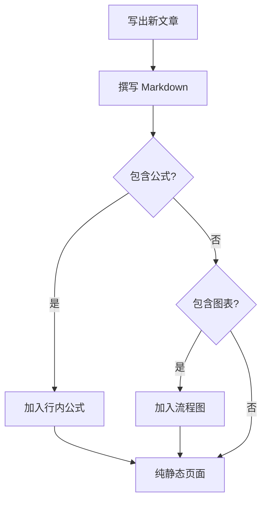

纯 Markdown 无法绘制公式、示意图或流程图，因此 mdweb 会在**构建时**
把下列语法渲染成 SVG：

- **LaTeX 数学公式** —— 行内用 `$…$`（或等价的 `$$…$$`/`\(…\)`），
  块级公式写在 ` ```math ` 围栏中，也可使用 LaTeX 的 `\[…\]` 形式
  或多行 `$$\n…\n$$` 块。
- **绘图环境** —— 语言标记为 `latex` / `tikz` / `xy` / `picture` 的
  围栏代码块（或 `\[…\]` 包裹）中的 `picture`、xy-pic 与 TikZ 环境
  会一并渲染为矢量图，其中的公式标签仍然由同一个数学引擎排版。
- **Mermaid 流程图** —— 使用语言标记为 `mermaid` 的围栏代码块。

输出是直接嵌入 HTML 的行内 `<svg>`。不需要 MathJax、不需要 Mermaid.js，
也不需要 CDN —— 页面完全离线，且不额外加载任何资源。

## 行内公式

行内公式通过 `$…$` 写在句子中间（也支持 `$$…$$` 或 `\(…\)`）：

> 一元二次方程 $ax^2 + bx + c = 0$ 的求根公式为
> $x = \frac{-b \pm \sqrt{b^2 - 4ac}}{2a}$，沿用至今。

`\(…\)` 写法也完全一致：$\mathrm{e}^{i\pi} + 1 = 0$ 是欧拉恒等式，
写作 \(\mathrm{e}^{i\pi} + 1 = 0\) 亦可。

## 独占一行的公式（Display math）

块级公式使用 ` ```math ` 围栏、LaTeX 的 `\[…\]` 形式，或多行
`$$\n…\n$$` 块：

```math
\int_{-\infty}^{+\infty} e^{-x^2} \, dx = \sqrt{\pi}
```

```math
\sum_{n=1}^{\infty} \frac{1}{n^2} = \frac{\pi^2}{6}
```

## 绘图环境

` ```math ` 围栏（或 `\[…\]`）除了公式，还接受语言标记为 `latex` /
`tikz` / `xy` / `picture` 的围栏代码块来承载三种经典绘图包。标签里
出现的公式仍由数学引擎排版：

```math
\xymatrix{
  A \ar[r]^f \ar[d]_g & B \ar[d]^{g'} \\
  D \ar[r]_{f'}        & C
}
```

```latex
\begin{tikzpicture}
\draw[->] (-0.2,0) -- (4.2,0) node[right] {$x$};
\draw[->] (0,-0.2) -- (0,3.2) node[above] {$y$};
\draw[color=blue] plot (\x,{sin(\x r)}) node[right] {$y=\sin x$};
\end{tikzpicture}
```

若源码暂时无法解析，会与 mermaid 一样自动退化为代码块，而不是让页面
出错——这意味着你可以一边调试一边刷新，不必担心破坏正文。

## Mermaid 流程图（Flowchart）

在 ` ```mermaid ` 围栏中编写的流程图会在构建时渲染成 SVG：



如果图表无法解析（缺少 `graph`/`flowchart` 头、没有节点），mdweb
会退化为普通代码块，而不是丢弃内容。

其它语言的围栏代码块不受影响，与非图表的普通代码行为完全一致：

```text
这不是图表，只是一个代码块
```